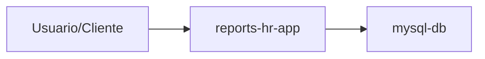

# Deploy

## Diagrama de despliegue

## Notas

- Los puertos de la app y de la base de datos son configurables segun el entorno (dev/stg/prod).
- En un flujo de CI/CD, el JAR debe llegar configurado para permitir el push de la imagen a un registro de contenedores.
- Se usa una imagen multi-stage y capas (layertools) de Spring Boot para acelerar builds y releases.
