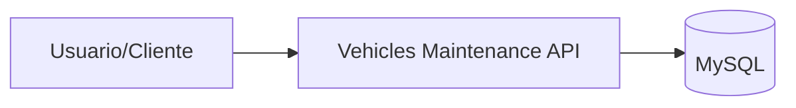

# Diagrama de despliegue

Este documento describe un despliegue basico del servicio y sus dependencias.

## Diagrama (Mermaid)

## Componentes

- **Usuario/Cliente**: consume la API.
- **Vehicles Maintenance API**: servicio principal.
- **MySQL**: base de datos relacional.

## Notas

- Se usa una imagen multi-stage y capas (layertools) de Spring Boot para acelerar builds y releases.
- El JAR generado es independiente del entorno, y la configuracion (puertos, datasource) se inyecta via variables de entorno o archivos de propiedades segun el entorno.
- El contexto actual expone la API en `http://localhost:8080/api/v1` cuando se ejecuta localmente.
